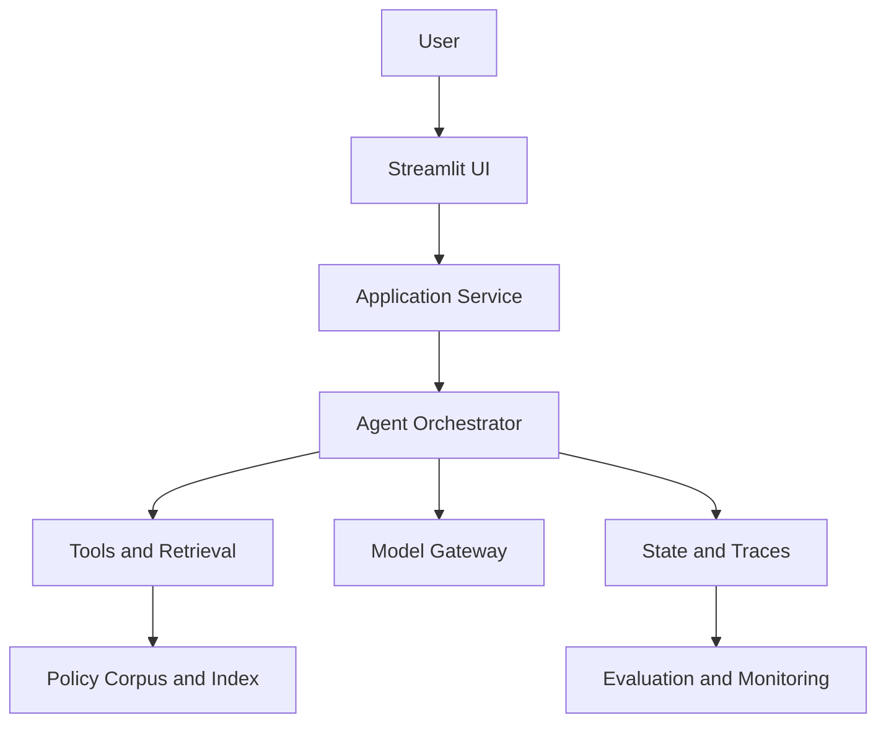

<!-- markdownlint-disable MD013 -->

# Agentic AI Architecture

A portfolio-ready reference architecture for evolving a grounded retrieval-augmented application into a bounded, observable, and evaluable agentic system.

The design focuses on the engineering capabilities that make agentic AI systems credible beyond a demo:

- explicit planning and controlled tool use;
- grounded retrieval with source provenance;
- typed workflow state and session memory;
- inspectable execution traces;
- component-level and end-to-end evaluation;
- safe clarification, abstention, and failure handling;
- a Streamlit experience that makes system behavior visible.

## Architecture at a glance



## Read the guide

The complete [Architecture, Evaluation, and Implementation Guide](docs/ARCHITECTURE.md) includes:

- system context, runtime, sequence, retrieval, and dependency diagrams;
- component boundaries and typed Python contracts;
- tool registry, model gateway, memory, and observability design;
- versioned evaluation datasets, scoring methods, and release gates;
- failure taxonomy and regression workflow;
- suggested repository structure, CI checks, security controls, and implementation phases;
- a GitHub publishing checklist and definition of done.

## Intended use

This repository is an architecture and learning artifact. It can be used to:

- guide implementation of an agentic policy or knowledge assistant;
- explain design decisions during portfolio reviews and interviews;
- structure phased development in Cursor or another IDE;
- establish evaluation requirements before expanding agent autonomy;
- document the gap between a current implementation and its target state.

## Core design stance

The reference system uses a **bounded workflow graph**, not an open-ended autonomous loop. The agent chooses only from allow-listed, schema-validated tools; every route, tool call, evidence package, verification result, and terminal state is traceable.

When evidence is missing, ambiguous, or conflicting, the system should clarify or abstain rather than generate an unsupported answer.

## Repository structure

```text
.
├── README.md
└── docs/
    └── ARCHITECTURE.md
```

Future implementation code can follow the structure proposed in the architecture guide.

## Status

This repository documents a **target architecture**. Individual capabilities should be marked as implemented only when supported by code, tests, traces, or evaluation evidence.

## License

MIT License. See [LICENSE](LICENSE) when present.
