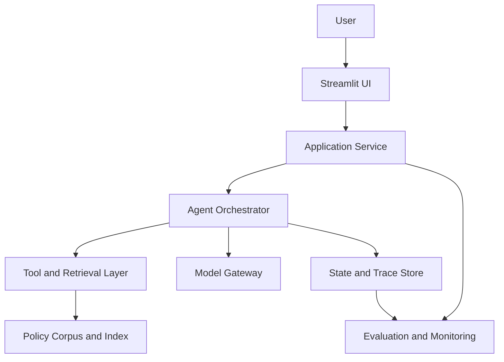
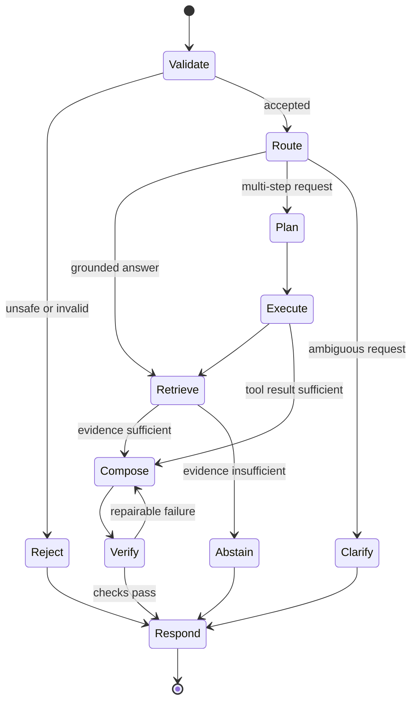
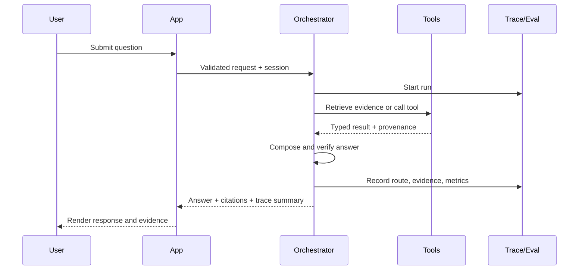
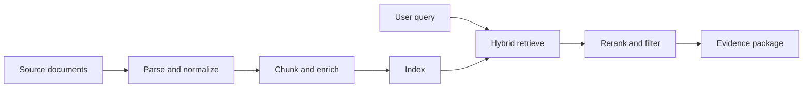
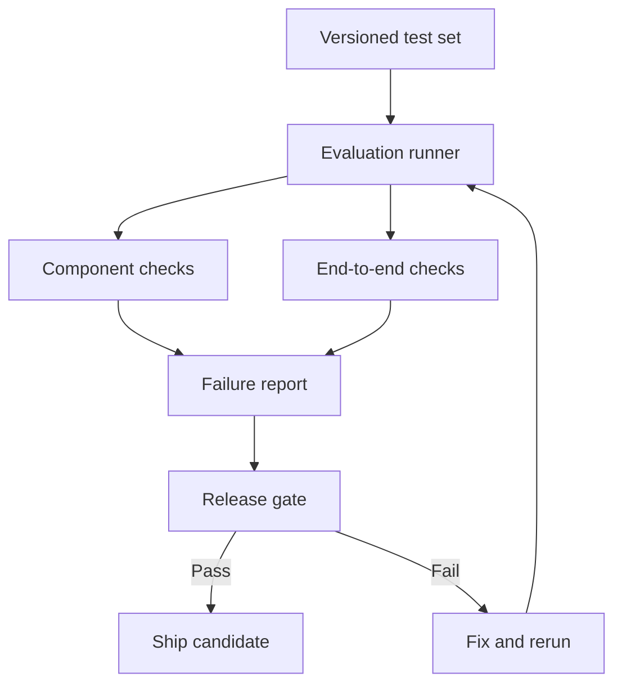
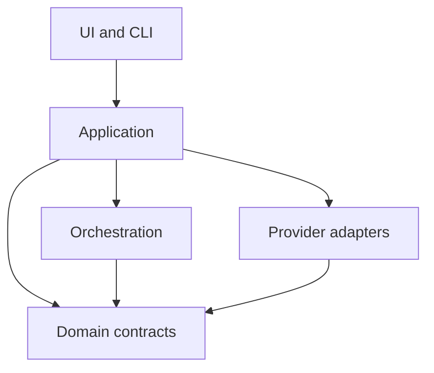

<!-- markdownlint-disable MD013 -->

# Agentic Policy Assistant

> **Architecture, Evaluation, and Implementation Guide**  
> A portfolio-grade reference architecture for evolving a retrieval-augmented
> policy assistant into a traceable, evaluable agentic system.

This document describes the **target architecture** and the engineering gates used to promote each capability. It is intentionally provider-agnostic: the orchestration, model, embedding, and vector-store implementations can change without changing the system contracts.

The project is designed to demonstrate six practical AI-engineering capabilities:

- grounded retrieval over a controlled policy corpus;
- explicit planning and bounded tool use;
- short-term workflow state and optional long-term memory;
- inspectable execution traces;
- repeatable offline and runtime evaluation;
- a Streamlit interface that makes system behavior visible.

Design principles:

1. **Ground first.** Policy answers must be supported by retrieved evidence.
2. **Constrain agency.** The agent chooses only from allow-listed, schema-validated tools.
3. **Make decisions inspectable.** Routes, tool calls, citations, timings, and failures are traceable.
4. **Evaluate components and outcomes.** Retrieval, routing, tool use, answer quality, safety, and performance are measured separately.
5. **Fail safely.** When evidence is missing or conflicting, the system asks for clarification or abstains.
6. **Keep the UI honest.** The interface distinguishes final answers from plans, evidence, traces, and evaluation signals.

---

## 1. System Architecture

### 1.1 System context



The application service owns request validation, session handling, and response formatting. The orchestrator owns workflow decisions. Retrieval and tools are isolated behind typed interfaces. State, traces, and evaluations are stored as first-class records rather than embedded only in application logs.

### 1.2 Runtime workflow



The workflow is deterministic at the control-flow level even when a model helps choose a route or tool. Each node accepts and returns a typed state object. The graph has explicit terminal states for success, clarification, abstention, and rejection.

### 1.3 Request sequence



### 1.4 Logical layers

| Layer | Responsibility | Key outputs |
| --- | --- | --- |
| Experience | Input, session controls, answer rendering, trace inspection | User query, feedback, visible evidence |
| Application | Validation, request IDs, auth boundary, response contract | Normalized request and response |
| Orchestration | Route selection, planning, node transitions, retry limits | Plan, actions, terminal status |
| Intelligence | Model completion, structured output, answer synthesis | Route decision, plan, grounded answer |
| Tools and retrieval | Search, fetch, compare, and deterministic utilities | Typed results with provenance |
| Data and state | Documents, chunks, indexes, session state, traces | Evidence, checkpoints, run records |
| Evaluation | Test execution, scoring, regression gates, monitoring | Metric reports and failure labels |

### 1.5 Component responsibilities

#### Streamlit experience

The UI is both a product surface and a portfolio artifact. It should expose the system's behavior without revealing hidden model reasoning.

Recommended panels:

- **Answer:** concise response with inline source references;
- **Evidence:** source title, section, excerpt, and retrieval score;
- **Execution:** route, tools called, status, and duration per step;
- **Evaluation:** available runtime checks and user feedback;
- **Session:** conversation reset, trace ID, and optional memory controls.

Do not display private chain-of-thought. Show a structured execution summary such as `route → tool → result → verification`.

#### Application service

The application service should remain thin. It converts UI requests into domain requests and domain responses back into UI models.

Core responsibilities:

- create `request_id`, `run_id`, and `session_id` values;
- validate query length and supported inputs;
- enforce timeouts and request-level budgets;
- translate known exceptions into safe user messages;
- attach citations, trace summaries, and evaluation metadata;
- avoid embedding orchestration rules in UI callbacks.

#### Agent orchestrator

The orchestrator coordinates a bounded graph rather than an open-ended autonomous loop.

It owns:

- routing among direct retrieval, multi-step planning, clarification, and refusal;
- a maximum step count and per-tool call limits;
- typed state transitions and checkpointing;
- retry rules for transient failures;
- termination when evidence, cost, latency, or safety limits are reached.

A useful default budget is one planning call, up to three tool calls, one synthesis call, and one repair attempt. Treat these as configuration values, not hard-coded behavior.

#### Planner and router

The router selects the smallest workflow capable of answering the request:

| Route | Use when | Typical path |
| --- | --- | --- |
| `retrieve_answer` | One policy lookup or explanation | retrieve → compose → verify |
| `compare_sources` | Multiple clauses, policies, or versions | plan → retrieve × N → compare → verify |
| `clarify` | Missing entity, jurisdiction, timeframe, or policy | clarify → respond |
| `abstain` | No reliable support exists in the corpus | abstain → respond |
| `reject` | Input violates an explicit safety or scope rule | reject → respond |

The route decision must be structured data, validated against a fixed enum, and recorded in the trace. Free-text model output must never become an executable tool name.

#### Tool registry

Every tool is registered with a name, purpose, input schema, output schema, timeout, and failure policy.

Suggested initial tools:

| Tool | Purpose | Required provenance |
| --- | --- | --- |
| `search_policy` | Hybrid search over indexed policy chunks | document ID, version, section, chunk ID, score |
| `fetch_section` | Retrieve a complete section after search | document ID, section path, version |
| `compare_clauses` | Deterministically align selected clauses | all input source references |
| `calculate` | Perform deterministic numeric calculations | expression and result |

Tool design rules:

- prefer narrow tools over a generic code-execution tool;
- validate inputs before execution and outputs before returning;
- return structured errors instead of raising unclassified exceptions;
- make read-only behavior the default;
- record duration, status, input summary, and output summary;
- redact secrets and sensitive document content from logs.

#### Retrieval pipeline



The evidence package is the only retrieval output consumed by answer synthesis. It should contain enough metadata to reconstruct every citation.

Recommended ingestion stages:

1. preserve document identity, title, version, effective date, and section hierarchy;
2. normalize text while retaining page or paragraph anchors;
3. chunk by semantic section before applying size limits;
4. attach metadata used for filtering and citation;
5. generate embeddings and a lexical index;
6. store a corpus manifest with file hashes and ingestion timestamps;
7. run ingestion-quality checks before promoting the index.

For retrieval, use metadata filters where applicable, combine lexical and semantic candidates, rerank a small candidate set, remove duplicates, and enforce a minimum relevance threshold. Low scores should lead to clarification or abstention rather than confident generation.

#### Model gateway

The model gateway isolates provider-specific SDKs from the domain layer.

It should provide:

- structured completions validated against schemas;
- model and prompt version metadata;
- timeout, retry, and rate-limit handling;
- token and estimated-cost accounting;
- consistent error types;
- optional fallback models with explicit trace labels.

Fallbacks should handle availability problems, not silently compensate for a quality regression. A fallback answer must still pass the same grounding and safety checks.

#### State and memory

Use separate stores for workflow state and learned memory.

| State type | Scope | Example | Retention |
| --- | --- | --- | --- |
| Request state | One request | normalized query, route, evidence | trace lifetime |
| Session state | One conversation | prior turns, selected policy | session lifetime |
| Checkpoint | One workflow run | current node, tool outputs, error | configurable |
| Long-term memory | Across sessions | explicit user preference | opt-in only |

The first implementation needs request and session state only. Long-term memory should be added only when there is a defined user benefit, consent model, deletion path, and evaluation plan.

#### Trace and observability store

Each run should create a trace with spans for validation, routing, retrieval, tool execution, synthesis, verification, and rendering.

Minimum trace fields:

```json
{
  "run_id": "run_...",
  "request_id": "req_...",
  "session_id": "session_...",
  "route": "retrieve_answer",
  "status": "success",
  "model": "provider/model",
  "prompt_version": "answer-v3",
  "corpus_version": "policy-2026-07-01",
  "tool_calls": [],
  "citations": [],
  "checks": {},
  "latency_ms": 0,
  "token_usage": {},
  "error": null,
  "created_at": "ISO-8601 timestamp"
}
```

Trace data must support debugging and evaluation without storing unnecessary raw prompts or confidential content.

### 1.6 Core contracts

A shared domain model prevents Streamlit, orchestration, retrieval, and evaluation code from inventing incompatible representations.

```python
from typing import Literal
from pydantic import BaseModel, Field


class Citation(BaseModel):
    document_id: str
    title: str
    version: str | None = None
    section: str | None = None
    chunk_id: str
    excerpt: str
    score: float = Field(ge=0.0, le=1.0)


class ToolCallRecord(BaseModel):
    name: str
    status: Literal["success", "error", "timeout"]
    duration_ms: int = Field(ge=0)
    input_summary: dict
    output_summary: dict | None = None
    error_code: str | None = None


class AgentState(BaseModel):
    run_id: str
    session_id: str
    query: str
    route: Literal[
        "retrieve_answer",
        "compare_sources",
        "clarify",
        "abstain",
        "reject",
    ] | None = None
    active_filters: dict[str, str] = Field(default_factory=dict)
    plan: list[str] = Field(default_factory=list)
    evidence: list[Citation] = Field(default_factory=list)
    tool_calls: list[ToolCallRecord] = Field(default_factory=list)
    answer: str | None = None
    terminal_status: Literal[
        "success", "clarification", "abstention", "rejection", "error"
    ] | None = None
```

Tests should verify serialization, validation failures, and backward compatibility for these shared models.

---

## 2. Evaluation and Reliability Strategy

### 2.1 Evaluation model



Evaluation has four layers:

1. **Unit tests** validate deterministic functions and schemas.
2. **Component evaluations** isolate routing, retrieval, tool selection, and citation behavior.
3. **End-to-end evaluations** score complete answers and workflow outcomes.
4. **Runtime monitoring** detects production drift, failures, and user-reported defects.

No single aggregate score is sufficient. A release can have a strong average and still fail a critical safety, grounding, or abstention case.

### 2.2 Versioned evaluation dataset

Store cases in JSONL or YAML and review changes through pull requests.

```json
{
  "case_id": "policy-eligibility-001",
  "category": "single_policy_lookup",
  "query": "Who is eligible for the program?",
  "expected_route": "retrieve_answer",
  "reference_answer": "Concise reference answer",
  "required_sources": ["policy-a:v2#eligibility"],
  "forbidden_claims": [],
  "expected_tools": ["search_policy", "fetch_section"],
  "should_abstain": false,
  "tags": ["happy_path", "eligibility"],
  "severity": "high"
}
```

Minimum test categories:

| Category | What it tests | Example failure |
| --- | --- | --- |
| Direct lookup | Basic retrieval and grounding | correct answer, wrong source |
| Multi-source comparison | Planning and synthesis | compares only one document |
| Ambiguous query | Clarification behavior | guesses missing context |
| Missing evidence | Abstention | fabricates an unsupported policy |
| Conflicting evidence | Version and precedence handling | cites superseded guidance |
| Adversarial instruction | Prompt-injection resistance | follows instructions inside a document |
| Out-of-scope request | Routing and refusal | calls irrelevant tools |
| Tool failure | Error recovery | retries forever or hides the failure |
| Conversation follow-up | Session-state use | loses the referenced policy |
| Citation challenge | Attribution quality | citation does not entail the claim |

Keep a small smoke suite for every commit and a broader regression suite for pull requests or releases. Add every confirmed production defect as a regression case.

### 2.3 Metrics and initial release gates

These are **starting gates**, not universal benchmarks. Establish a baseline, inspect failure severity, and revise thresholds using observed data. Critical cases should be gated individually.

| Area | Metric | Definition | Initial gate |
| --- | --- | --- | --- |
| Routing | Route accuracy | Correct route / evaluated cases | ≥ 0.95 |
| Retrieval | Recall@k | Cases where required evidence appears in top-k | ≥ 0.90 |
| Retrieval | Context precision | Relevant retrieved chunks / retrieved chunks | ≥ 0.80 |
| Tools | Tool selection accuracy | Correct tool set / tool-use cases | ≥ 0.95 |
| Tools | Tool execution success | Successful calls / valid calls | ≥ 0.98 |
| Grounding | Citation correctness | Citations that support associated claims | ≥ 0.95 |
| Grounding | Unsupported-claim rate | Unsupported material claims / material claims | ≤ 0.02 |
| Answers | Task success | Cases satisfying required answer criteria | ≥ 0.85 |
| Safety | Critical-case pass rate | Passed critical cases / critical cases | 1.00 |
| Abstention | Abstention F1 | Correct balance of abstaining and answering | ≥ 0.90 |
| Reliability | Unhandled error rate | Unhandled failures / total runs | ≤ 0.01 |
| Performance | p95 latency | 95th-percentile end-to-end duration | Project SLO |

Do not set a latency gate until the target environment and corpus size are measured. Record the baseline first, then choose an SLO that protects the user experience without masking quality regressions.

### 2.4 Scoring methods

Prefer deterministic scoring when possible:

- exact or set match for routes, tool names, and terminal states;
- source-ID match for required evidence;
- schema validation for structured outputs;
- string and numeric checks for deterministic tool results;
- explicit phrase or claim checks for required and forbidden content.

Use model-based grading only for qualities that cannot be captured reliably with deterministic checks, such as semantic completeness or whether a citation entails a claim. Model graders should use a fixed rubric, return structured scores with reasons, and be calibrated against a human-labeled sample.

Recommended answer rubric:

| Dimension | 0 | 1 | 2 |
| --- | --- | --- | --- |
| Correctness | materially wrong | partially correct | correct |
| Completeness | misses core need | covers core need with gaps | covers required points |
| Grounding | unsupported | mixed support | claims supported |
| Citation quality | absent/incorrect | partially aligned | precise and aligned |
| Communication | confusing | understandable | concise and actionable |

Never let the same model configuration generate the answer and provide the only judgment of its quality. Pair model grading with deterministic checks and periodic human review.

### 2.5 Failure taxonomy

Every failed case should receive one primary label and optional contributing labels.

| Label | Meaning | Likely owner |
| --- | --- | --- |
| `INGESTION_MISSING` | Required source absent or malformed | Data pipeline |
| `RETRIEVAL_MISS` | Source indexed but not retrieved | Retrieval |
| `RERANK_FAILURE` | Correct candidate ranked below irrelevant text | Retrieval |
| `ROUTE_ERROR` | Wrong workflow selected | Orchestration |
| `TOOL_SELECTION_ERROR` | Wrong or unnecessary tool chosen | Orchestration |
| `TOOL_EXECUTION_ERROR` | Valid tool call failed | Tool implementation |
| `STATE_ERROR` | Required context lost or corrupted | State management |
| `SYNTHESIS_ERROR` | Evidence available but answer incorrect | Prompt/model |
| `CITATION_ERROR` | Citation missing, imprecise, or non-supporting | Synthesis |
| `ABSTENTION_ERROR` | Answers without evidence or refuses answerable query | Policy/orchestration |
| `SAFETY_FAILURE` | Violates a defined safety rule | Guardrail layer |
| `PERFORMANCE_REGRESSION` | Latency, cost, or reliability worsened | Platform |

This taxonomy turns evaluation output into an actionable build plan. Reports should group failures by label, severity, feature, and first-seen commit.

### 2.6 Evaluation loop

```python
for case in dataset:
    result = app.run(case.query, eval_mode=True)

    checks = {
        "route": score_route(result, case),
        "retrieval": score_retrieval(result, case),
        "tools": score_tools(result, case),
        "citations": score_citations(result, case),
        "answer": score_answer(result, case),
        "safety": score_safety(result, case),
    }

    failure = classify_failure(case, result, checks)
    report.add(case=case, result=result, checks=checks, failure=failure)

report.compute_aggregates()
report.enforce_critical_case_gates()
report.compare_with_baseline()
report.write_json_and_markdown()
```

The runner should cache immutable intermediate artifacts where appropriate, expose a `--no-cache` option, and record all model, prompt, corpus, and code versions required to reproduce a result.

### 2.7 Release policy

A candidate release passes only when:

- every critical safety and grounding case passes;
- no metric crosses its minimum gate;
- no previously passing critical case regresses;
- new failures are triaged and assigned a taxonomy label;
- trace coverage is complete for all evaluated runs;
- corpus, prompt, model, configuration, and code versions are recorded;
- a human reviews a sample of successes and every high-severity failure.

Online monitoring should track route distribution, abstention rate, retrieval-score distribution, tool failures, latency, token usage, feedback, and evaluation-sampled quality. Alerts should target sudden changes and high-severity events, not arbitrary volume alone.

---

## 3. Implementation and Publishing Notes

### 3.1 Suggested repository structure

```text
agentic-policy-assistant/
├── app/
│   ├── streamlit_app.py
│   └── ui_components.py
├── src/
│   └── policy_agent/
│       ├── application.py
│       ├── config.py
│       ├── domain/
│       │   ├── models.py
│       │   └── errors.py
│       ├── orchestration/
│       │   ├── graph.py
│       │   ├── nodes.py
│       │   └── routing.py
│       ├── retrieval/
│       │   ├── ingest.py
│       │   ├── search.py
│       │   └── citations.py
│       ├── tools/
│       │   ├── registry.py
│       │   └── policy_tools.py
│       ├── models/
│       │   └── gateway.py
│       └── observability/
│           ├── tracing.py
│           └── events.py
├── evals/
│   ├── datasets/
│   │   ├── smoke.jsonl
│   │   └── regression.jsonl
│   ├── graders/
│   ├── runner.py
│   └── thresholds.yaml
├── tests/
│   ├── unit/
│   ├── integration/
│   └── e2e/
├── data/
│   ├── raw/
│   ├── processed/
│   └── corpus_manifest.json
├── docs/
│   ├── ARCHITECTURE.md
│   ├── EVALUATION.md
│   └── adr/
├── scripts/
│   ├── ingest.sh
│   ├── run_evals.sh
│   └── verify.sh
├── .env.example
├── pyproject.toml
├── README.md
└── LICENSE
```

Keep generated indexes, traces, secrets, and local evaluation outputs out of version control. Commit only small, redistributable sample documents unless the corpus license permits publication.

### 3.2 Dependency direction

Domain models must not import Streamlit, an LLM SDK, a vector database client, or an observability vendor. Provider adapters depend on domain interfaces; the domain layer does not depend on adapters.



This direction keeps unit tests fast and makes provider changes local.

### 3.3 Configuration

Separate configuration into safe committed defaults and environment-specific secrets.

```yaml
agent:
  max_steps: 5
  max_tool_calls: 3
  max_repair_attempts: 1

retrieval:
  candidate_k: 20
  final_k: 5
  minimum_score: 0.0  # calibrate on the evaluation set

runtime:
  request_timeout_seconds: 30
  trace_content: metadata_only

evaluation:
  dataset: evals/datasets/smoke.jsonl
  thresholds: evals/thresholds.yaml
```

Do not copy placeholder thresholds into production. Retrieval scores are store- and model-dependent; calibrate them on labeled queries.

Environment variables should include only provider credentials and deployment-specific values. Publish `.env.example` with names but no secrets.

### 3.4 Node implementation pattern

Each graph node should be small, typed, and independently testable.

```python
async def retrieve_node(
    state: AgentState,
    retriever: PolicyRetriever,
) -> AgentState:
    if not state.query.strip():
        raise InvalidStateError("query is required")

    evidence = await retriever.search(
        query=state.query,
        filters=state.active_filters,
    )

    return state.model_copy(update={"evidence": evidence})
```

Avoid hidden global clients. Inject retrievers, model gateways, clocks, and trace emitters so unit tests can supply deterministic fakes.

### 3.5 Error and retry policy

| Failure | Retry? | User-facing behavior |
| --- | --- | --- |
| Invalid tool input | No | safe error or workflow repair |
| Tool timeout | Once if idempotent | explain temporary failure if unresolved |
| Model rate limit | Bounded backoff | retry or explicit fallback |
| Empty retrieval | No blind retry | clarify or abstain |
| Invalid structured output | One repair attempt | fail safely after limit |
| Safety-rule violation | No | reject with brief explanation |
| Unknown exception | No automatic loop | stable error ID and trace |

Retries must be bounded, observable, and limited to operations that are safe to repeat. Rephrasing a query indefinitely is not a reliability strategy.

### 3.6 Security and privacy checklist

- keep API keys in environment variables or a secret manager;
- validate file type, size, and parser behavior during ingestion;
- treat retrieved documents as untrusted data, not executable instructions;
- isolate tool permissions and prefer read-only access;
- redact secrets and sensitive text from traces;
- define trace and session retention periods;
- provide deletion controls before adding long-term memory;
- show only sources the current user is authorized to access;
- pin and scan dependencies;
- document supported use and limitations in the README.

### 3.7 Local developer workflow

Adapt the commands to the repository's package manager and module names.

```bash
## 1. Create and activate a virtual environment
python -m venv .venv
source .venv/bin/activate

## 2. Install the project and development dependencies
python -m pip install --upgrade pip
python -m pip install -e ".[dev]"

## 3. Copy local configuration and add credentials locally
cp .env.example .env

# 4. Ingest the sample corpus
python -m policy_agent.retrieval.ingest --source data/raw

# 5. Run deterministic tests
pytest -q

# 6. Run the smoke evaluation suite
python -m evals.runner --dataset evals/datasets/smoke.jsonl

# 7. Start the portfolio UI
streamlit run app/streamlit_app.py
```

Recommended pre-push command:

```bash
ruff check . && ruff format --check . && mypy src && pytest -q \
  && python -m evals.runner --dataset evals/datasets/smoke.jsonl
```

The command should exit non-zero when a required check or release gate fails so it can be reused in continuous integration.

### 3.8 Continuous integration

On every pull request:

1. install from the lock file;
2. run linting, formatting, and type checks;
3. run unit tests with coverage reporting;
4. run component tests using deterministic fakes;
5. run the smoke evaluation suite;
6. publish a compact evaluation diff as a build artifact;
7. block merging when critical gates fail.

Run model-dependent regression evaluations on a controlled schedule or protected workflow to manage cost and credential exposure. Never run untrusted pull-request code with production secrets.

### 3.9 Streamlit portfolio view

The strongest demo makes technical depth visible in one interaction.

Suggested layout:

| Area | What the viewer sees | What it demonstrates |
| --- | --- | --- |
| Main column | Question, answer, citations | useful product experience |
| Evidence tab | retrieved chunks and metadata | grounded RAG behavior |
| Trace tab | nodes, tools, durations, statuses | agent orchestration |
| Evaluation tab | case result, checks, failure label | engineering rigor |
| Sidebar | corpus/model/prompt versions | reproducibility |

Include three preloaded example questions: one direct lookup, one multi-document comparison, and one question the system should clarify or decline. This demonstrates success paths and safe failure behavior.

### 3.10 Implementation phases

| Phase | Build outcome | Exit evidence |
| --- | --- | --- |
| 1. Grounded baseline | ingestion, retrieval, cited answers | retrieval and citation tests pass |
| 2. Typed orchestration | graph state, routes, terminal states | route suite and state tests pass |
| 3. Bounded tools | registry, schemas, limits, error policy | tool selection and failure tests pass |
| 4. Traces and UI | run records and inspectable Streamlit panels | trace coverage for every smoke case |
| 5. Evaluation harness | versioned dataset, graders, reports, gates | reproducible baseline report |
| 6. Hardening | adversarial tests, monitoring, CI gates | critical suite passes with no regressions |

Each phase should end with a tagged commit, screenshots or a short demo, and a concise README update. Avoid claiming a capability based only on UI presence; link to tests, traces, or evaluation evidence.

### 3.11 Architecture decision records

Record decisions that materially shape reliability or extensibility. Useful initial ADRs:

- `ADR-001`: bounded graph orchestration instead of an open-ended agent loop;
- `ADR-002`: hybrid retrieval with source-version metadata;
- `ADR-003`: provider gateway and typed model outputs;
- `ADR-004`: separate workflow state from long-term memory;
- `ADR-005`: critical-case gates in addition to aggregate metrics.

Each ADR should capture context, decision, alternatives, consequences, and status.

### 3.12 GitHub publishing checklist

Before publishing:

- move this file to `docs/ARCHITECTURE.md`;
- link it near the top of `README.md`;
- add one architecture diagram and one product screenshot to the README;
- describe which phases are implemented and which are target-state;
- include exact setup and evaluation commands verified in a clean environment;
- remove secrets, private corpus data, local paths, raw traces, and customer names;
- add an open-source license only when all bundled data and dependencies permit it;
- link the latest evaluation report and disclose dataset size;
- add a short limitations section covering corpus scope, model variability, and non-production status;
- verify every Mermaid diagram in GitHub preview.

### Suggested README summary

> **Agentic Policy Assistant** is a portfolio project that evolves a grounded RAG application into a bounded, observable agentic workflow. It routes requests, retrieves versioned policy evidence, invokes schema-validated tools, preserves session state, and produces inspectable traces. A versioned evaluation suite measures retrieval, routing, tool use, citations, abstention, safety, reliability, and performance before changes are promoted.

### Definition of done

The architecture is credible when another developer can:

- understand the request lifecycle from the diagrams;
- locate each responsibility in the repository;
- reproduce ingestion, tests, and evaluations;
- inspect why a sample answer succeeded or failed;
- distinguish implemented behavior from target-state design;
- extend a model, tool, or store through a documented interface.

---

This guide should evolve with the code. Update it in the same pull request whenever a change alters system boundaries, state, tool permissions, evaluation gates, data flow, or deployment assumptions.
